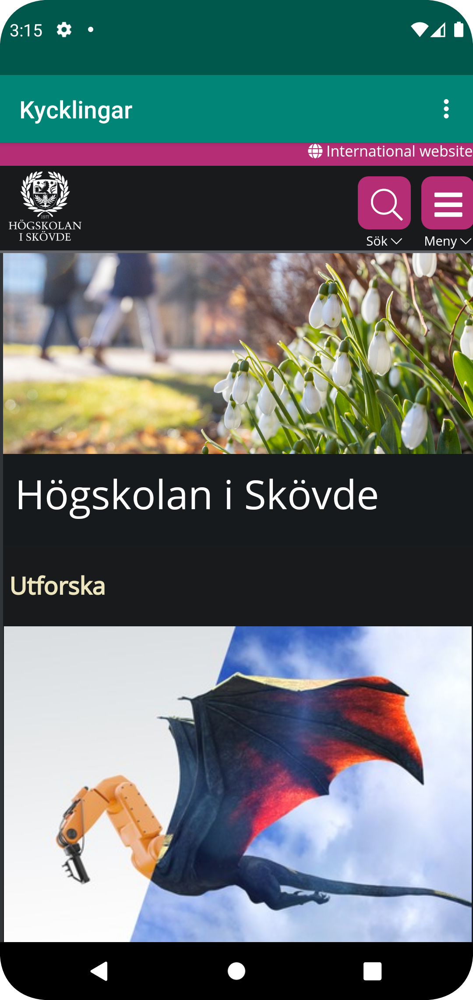
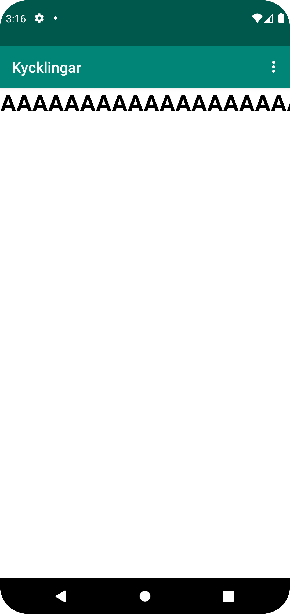

# Rapport

Det första som gjordes var att ändra på namnet på sidan i string.xml, 
sedan lades internet accessen i AndroidManifest.xml till, sedan allt med webview 
i activity_main.xml, sedan allt med webclient och myWebView i MainActivity.java,
sedan sist fixades external och internal webviewsen, där internal ligger i about.html.
Här lades även de rätta url:sen i rätt voids. Samt lades "show" till för båda.

```
   1. <string name="app_name">Kycklingar</string>
   2. <uses-permission android:name="android.permission.INTERNET" />
   3. Webview ändrades inom design, inte kod.
   4. myWebView.getSettings().setJavaScriptEnabled(true);
```


